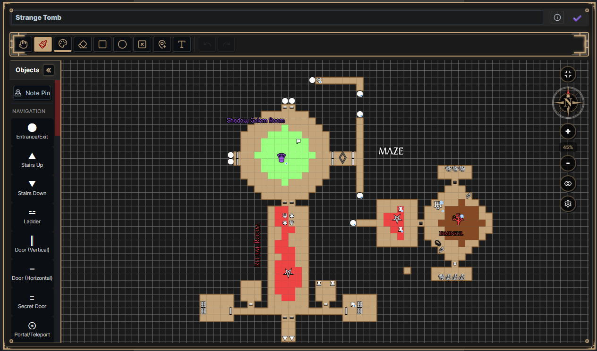
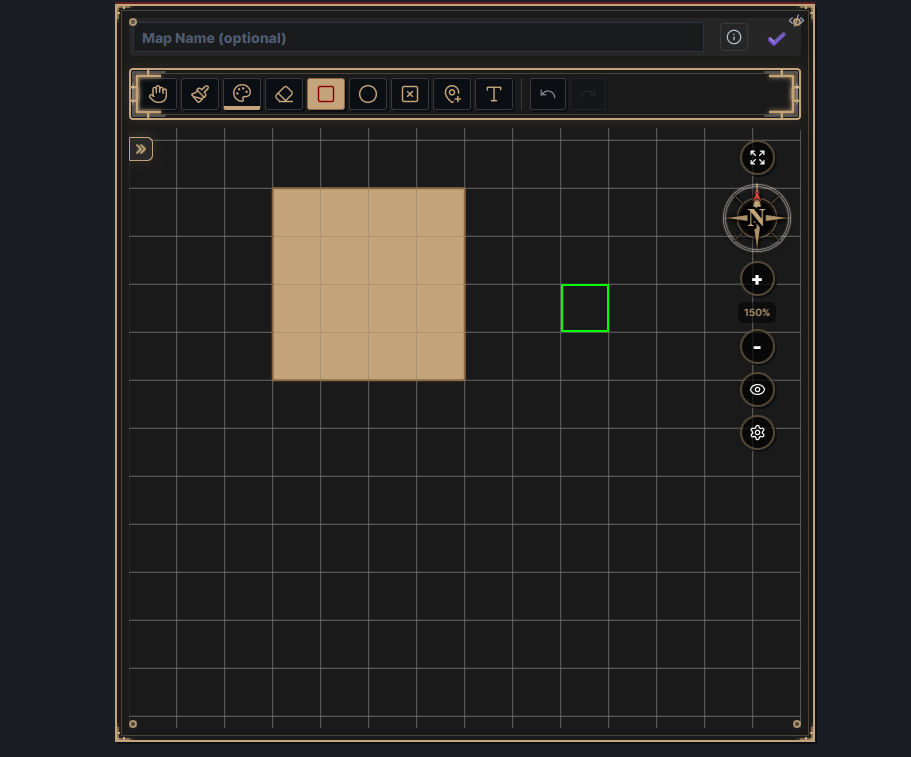
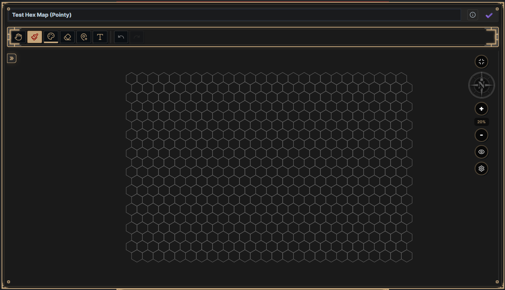
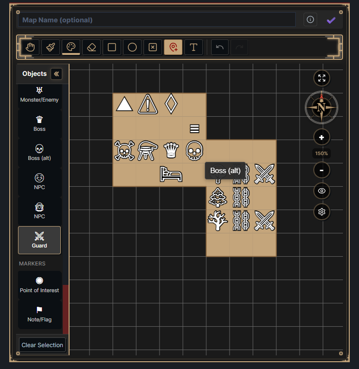

WIndrose MapDesigner (WindroseMD) is a simple TTRPG-focused mapping tool for Obsidian, built on [Datacore](https://github.com/blacksmithgu/datacore). It started as something like graph paper in Obsidian and then... grew? Supports both traditional grid based maps as well as hex maps, with a bevy of customization options, an emphasis on (what I think is) thoughtful design, and first class mobile/touch compatability.

Low tech enough to run in your text editor, high tech enough to... make you forget you're in your text editor?

"Windrose" is an obvious reference to a compass rose, a visual object I've always had a fascination with. If anything, the marketing copy is that it speaks to the "care in design" I put into this project, but really I just liked the name, and like compass roses (and am not a designer). Feel free to refer to this project as just "Map Designer" if you want--above all I want this tool to be useful. 

## What It Does

Draw dungeons or world maps cell-by-cell (or rectangle by rectangle (or circle by circle)), drop in objects for doors and traps and treasure, add your own text labels (with fonts!), and of course link things to your notes (remember? We're in your text editor). Designed to work in Reading mode, Live Preview, inside callouts, etc.

With release 1.0.0, Windrose now supports hex maps as well (pointy/flat/radial coordinates/background image support). Hex is still a work in project which will be iterated on in the very near future, but I'm excited to share what I have

Touch is first class for Windrose. It is designed to be usable on tablets with touch—pan around, pinch to zoom, tap to place things. And it's at least somewhat performance.

That said, it also works fully on desktop Obsidian, with the added convenience of keyboard and mouse shortcuts.

## Features

**Drawing**

- Paint cells with customizable colors
- Rectangle and circle fill tools
- Erase tool (or clear entire areas if your artistic vision is scuffed/a cat walks on your keyboard)
- 50-level undo/redo (for when the cat walks on your keyboard a lot)

**Hex Maps**
- Supports both pointy and flat-top hexes, configurable in global settings as a default.
- Set a size for your grid.
- Display coordinates.
- Coordinates can be configured to display as the default rectangle, or set to display a radial hex grid. Full radial/center out support coming soon.
- Supports background images. Select any image from your vault, and how many hexes you want to divide it into (with presets, as well as full customization).

**Objects**

- ~40 object types across categories: navigation (doors, stairs, portals), hazards (traps, pits), dungeon features (chests, altars, furniture), encounters (monsters, NPCs, bosses), and general markers.
- Resize objects, rotate them, change their colors (including being able to assign custom ones), add notes, forget what the heck ♅ means (don't worry, there's tooltips). You can also move them around.
- Objects can be placed in the center of a grid space, or hold ALT while placing or dragging an object to enter Snap to Edges mode, which allows you to place objects on grid lines.
- Link any object to an Obsidian note—hover to preview, ctrl/cmd+click to open

**Text Labels**

- Place labels anywhere—no grid limitations
- Drag, rotate, edit in place
- Customize font, color, size, etc etc (with live preview)

**Navigation**

- Space+drag or two-finger pan (or hold scroll wheel)
- Scroll wheel or pinch to zoom
- Rotate the whole map (the "Windrose") 

**Configuration**
- Comes with its own optional plugin, which can be installed and updated with the click of a (couple) buttons. This plugin allows you to set global defaults for things like colors, hex map orientation, etc. It is 100% optional, and you will not be asked again if you decline. NOTE: Currently hex map orientation will be very annoying to swap without the plugin, but can still be changed. This will be updated soon.
- Each map has per map settings, including local overrides for any global settings, fiddly UI preferences you probably won’t need, and additional hex map options to configure size or background image. 

## Installation
Windrose is distributed as a “compiled” Datacore script, which just means it’s been all packaged up in a single Markdown file, for nice and easy use.

There is also an optional but STRONGLY recommended Templater template included. All it does is just give you a shortcut to insert a new map, but it makes that process effortless, something which can otherwise be fiddly. But also completely optional.

1. Download the latest release from the Release page.
2. Copy `compiled-windrose-md.md` anywhere into an Obsidian vault, and the optional (but strongly recommended) Map Designer Template into your Templater templates folder (if using).
3. Install Datacore and Templater (if using) from Community Plugins.
4. Note that on its first run, Windrose will create a `windrose-map-data.json` file in your vault’s root. You may move this file wherever you want in your vault, but you may only have one file of this name in your vault, and this will hold all your map data, so don’t lose it.

## Usage

1. Run Templater template  (or copy/reference demo block from compiled script)
2. Choose a name for your map, and a type (Grid or Hex)
3. Accept or decline plugin installation
	3a. Enable plugin if installed (or you may enable later, as any plugin).
4. Start mapping!

## Thanks to
Blacksmithgu for creating Datacore, and making it easy enough to trick myself into thinking that learning React was a good idea.

Many members of the Obsidian TTRPG discord, including:
- BloatedBlowfish
- Coehoorn
- drgonls
- LastElf
- And many others, especially those who goaded me into and taught me about hex mapping.

And my DM, who got me excited about both TTRPGs, but also having fun with software dev again.