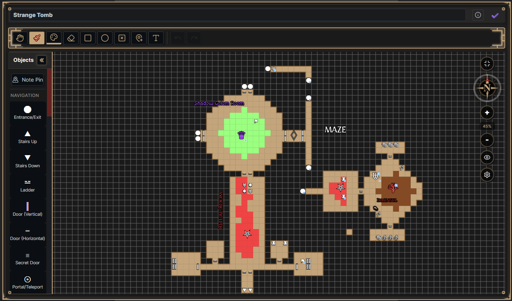
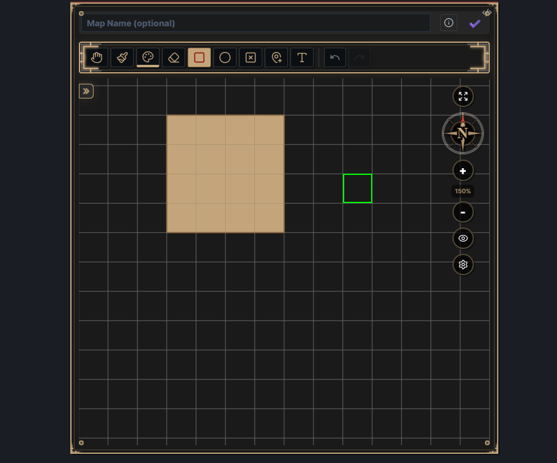
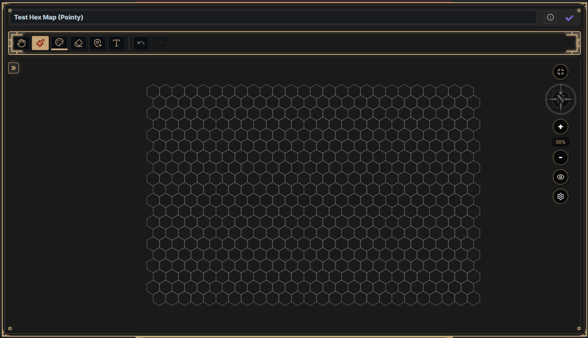
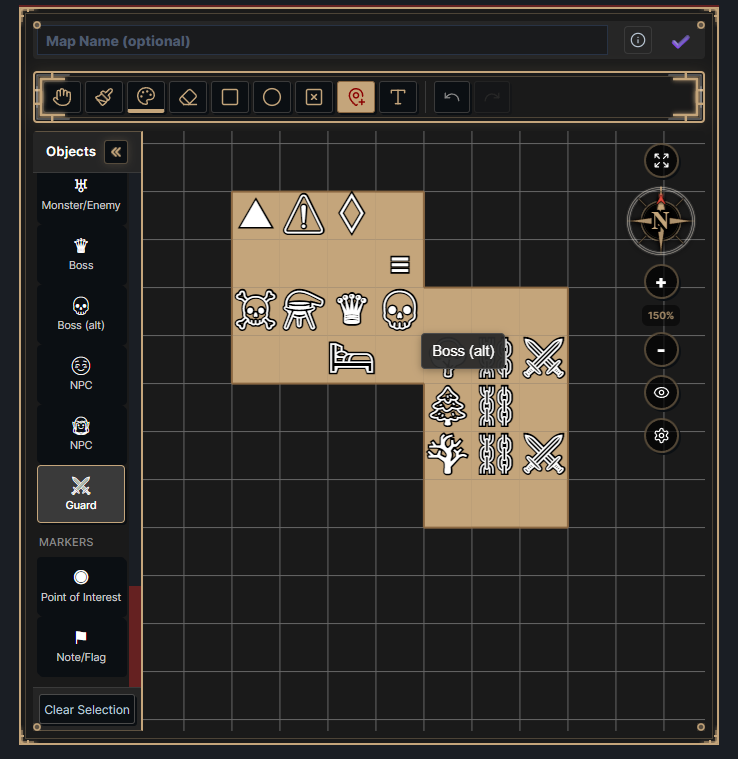
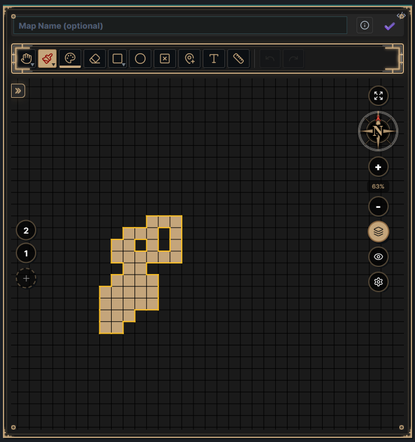
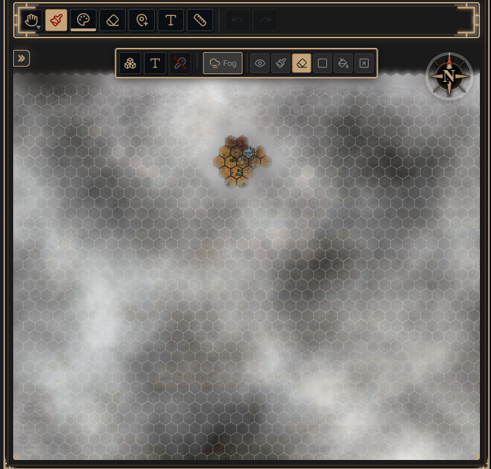

Windrose MapDesigner (WindroseMD) is a TTRPG-focused mapping tool for Obsidian. It started as something like graph paper in Obsidian and then... grew? Supports both traditional grid based maps as well as hex maps, with a bevy of customization options, an emphasis on (what I think is) thoughtful design, and first class mobile/touch compatibility.

Low tech enough to run in your text editor, high tech enough to... make you forget you're in your text editor?

> **Looking for a full feature breakdown?** Check out the [Feature List](src/Windrose%20Feature%20docs.md) for detailed descriptions of everything Windrose can do.



"Windrose" is an obvious reference to a compass rose, a visual object I've always had a fascination with. If anything, the marketing copy is that it speaks to the "care in design" I put into this project, but really I just liked the name, and like compass roses (and am not a designer). Feel free to refer to this project as just "Map Designer" if you want--above all I want this tool to be useful.

## What It Does

Draw dungeons or world maps cell-by-cell (or rectangle by rectangle (or circle by circle)), drop in objects for doors and traps and treasure, add your own text labels (with fonts!), and of course link things to your notes (remember? We're in your text editor). Designed to work in Reading mode, Live Preview, inside callouts, etc.

Windrose supports both grid (square) maps and hex maps — including radial hex grids, nested sub-maps, and definable regions. Hex and grid each have their own strengths, and the feature set for both continues to grow.

Touch is first class for Windrose. It is designed to be usable on tablets with touch—pan around, pinch to zoom, tap to place things. And it's at least somewhat performance.

That said, it also works fully on desktop Obsidian, with the added convenience of keyboard and mouse shortcuts.

## Features

**Drawing**

- Paint cells with customizable colors (and opacity)
- Rectangle and circle fill tools (with live size previews)
- Partial cell painting via segments — subdivide grid cells into triangles for diagonals, half-cells, and smooth edges
- Freehand drawing — create organic, non-grid-locked shapes that merge with your painted cells. Closed shapes are erasable cell-by-cell, just like normal paint.
- Erase tool (or clear entire areas if your artistic vision is scuffed/a cat walks on your keyboard)
- 50-level undo/redo (for when the cat walks on your keyboard a lot)



**Hex Maps**
- Supports both pointy and flat-top hexes, configurable in global settings as a default.
- **Radial** (ring-based) or **rectangular** (offset) hex grid layouts, configurable per map.
- Set a size for your grid — measured in rings for radial, rows/columns for rectangular.
- Display coordinates.
- Up to 4 objects allowed per hex, for any regions with multiple points of interest.
- Supports background images. Select any image from your vault, and how many hexes you want to divide it into (with presets, as well as full customization).
- **Tile images** — import tileset folders from your vault and paint hex tiles with click or drag. Supports rotation, horizontal flip, and freeform stamp placement for non-grid-locked tile positioning.



**Regions** (Hex only)
- Define named, colored regions on your hex maps — paint them hex-by-hex or draw a polygon boundary.
- Region names display as labels that scale with zoom.
- Regions sidebar lets you jump to or toggle visibility for any region.
- Regions can be linked to notes, just like objects.
- Full undo/redo support for region operations.

**Sub-Maps** (Hex only)
- Drill down from any hex into a nested sub-map — think clicking a city on your world map to see it in detail.
- Sub-maps are full Windrose instances with their own settings, layers, and regions.
- Breadcrumb navigation shows where you are in the hierarchy and lets you jump back up.
- No hardcoded nesting limit (though performance may vary at extreme depths).

**Objects**
- ~40 object types across categories: navigation (doors, stairs, portals), hazards (traps, pits), dungeon features (chests, altars, furniture), encounters (monsters, NPCs, bosses), and general markers.
- Full object customization: Rename, rearrange, delete, change the icon of any default object, as well as adding your own custom objects and categories. Supports any unicode character (so long as you have a supporting font), as well as the bundled RPG Awesome icon set. Or use your own images.
- Object Sets — import or create themed object packs (think "tile sets") and swap between them globally or per map.
- Resize objects, rotate them (including 45° angles), change their scale, change their colors (including being able to assign custom ones), add notes, forget what the heck ♅ means (don't worry, there's tooltips). You can also move them around.
- Freeform placement — unlock objects from the grid for free world-space positioning (Alt+Shift+click, or toggle per object).
- Objects can be placed in the center of a grid space, or hold ALT while placing or dragging an object to enter Snap to Edges mode, which allows you to place objects on grid lines.
- Link any object to an Obsidian note—hover to preview, ctrl/cmd+click to open
- Deep linking — copy a link to any object and paste it in another note. Clicking it opens the map and zooms to that object.
- Inter-map linking — link objects to each other (great for staircases between layers, portals, etc).



**Text Labels**
- Place labels anywhere, with no grid limitations
- Drag, rotate, edit in place
- Customize font, color, size, opacity (with live preview)
- Link labels to notes, just like objects

**Map Layers**
- Add multiple layers to your map, to represent different levels, alternate states, or anything else you want.
- Adjustable layer opacity lets lower layers peek through for visual alignment.
- Rename layers and assign custom icons.



**Fog of War**
- Add fog of war to your hex or grid maps, using either a color of your choice, or import your own tileable image from your vault.
- Optional and configurable edge blurring effect makes for a more immersive fog effect.
- Add or remove fog from individual cells, fill areas, or add or remove fog from the entire map.



**Random Dungeon Generation**
- Generate random dungeon layouts with an Obsidian command. (This is pure old fashioned math and graphs, no AI involved, just for reference—in fact, the live animation when generating a random dungeon is an approximation of how the dungeon is generated. Not that you cared.)
- Choose from styles (Classic, Cavern, Fortress, Crypt) and sizes, or customize deeper with an assortment of advanced sliders for room shapes, corridor styles, door frequency, water features, and more.
- Optional dungeon stocking populates rooms with monsters, traps, treasure, and themed furniture. 
- Optional auto fog of war for solo play.

**Navigation**
- Space+drag or two-finger pan (or hold scroll wheel)
- Scroll wheel or pinch to zoom
- Rotate the whole map (via the "Windrose")

**Configuration**
- Full settings tab in Obsidian’s plugin settings. Handles global defaults, custom object management, color palettes, tileset folders, keyboard shortcuts, and more.
- Each map has per-map settings, including local overrides for any global settings, fiddly UI preferences you probably won’t need, and additional hex map options to configure size or background image.

## Installation

### From Community Plugins (coming soon)
1. Open Settings → Community Plugins → Browse
2. Search for “Windrose MapDesigner”
3. Install and enable

### Via BRAT (beta testing)
1. Install the [BRAT](https://github.com/TfTHacker/obsidian42-brat) plugin from Community Plugins
2. Add `alas-poor-ophelia/windrose-md` as a beta plugin in BRAT settings
3. BRAT will install and keep it updated

### Manual Installation
1. Download `main.js`, `styles.css`, and `manifest.json` from the [latest release](https://github.com/alas-poor-ophelia/windrose-md/releases)
2. Create a folder called `windrose-md` in your vault’s `.obsidian/plugins/` directory
3. Copy the three files into that folder
4. Enable the plugin in Settings → Community Plugins

### Migrating from the Datacore version
Your existing maps will migrate automatically. On first load, Windrose imports your settings and locates your data files from the previous installation. No manual steps required. You can safely disable the old Datacore-based version afterward.

## Usage

1. Open your command palette (Ctrl/Cmd+P)
2. Search for “Windrose”

**Creating a new blank map:**
1. Select “Insert new map” and follow prompts to choose map type and name
2. Start mapping!

**Generating a random dungeon:**
1. Select “Generate a random dungeon”, and customize to your liking
2. Start exploring and editing!

**Using windrose-map code blocks:**

Windrose uses a `windrose-map` code block syntax. This is used by the “Insert new map” command automatically. The syntax is:

````
```windrose-map
id: your-map-id
name: My Map
type: grid
```
````

Fields: `id` (required, unique identifier), `name` (display name), `type` (`grid` or `hex`). Map data is stored in `windrose-map-data.json`, referenced by the `id`.

## Thanks to
Blacksmithgu for creating [Datacore](https://github.com/blacksmithgu/datacore) — Windrose started life as a Datacore compiled script, and that framework is what made it possible to trick myself into thinking that learning React was a good idea. v2.0 is a standalone plugin, but we wouldn’t be here without that foundation.

Many members of the Obsidian TTRPG discord, including:
- BloatedBlowfish
- Coehoorn
- 36457453746
- LastElf
- And many others, especially those who goaded me into and taught me about hex mapping.

And my DM, who got me excited about both TTRPGs, but also having fun with software dev again.