# Windrose MapDesigner

A TTRPG mapping tool that lives in your Obsidian notes. Windrose started as something like graph paper in Obsidian and then... grew. Draw dungeons and world maps on grid or hex, paint them with image tiles, stock them with objects and labels, obscure them with fog of war — and link all of it to your notes, because you never left your text editor.

Low tech enough to run in your note-taking app, high tech enough to make you forget you're in your note-taking app.

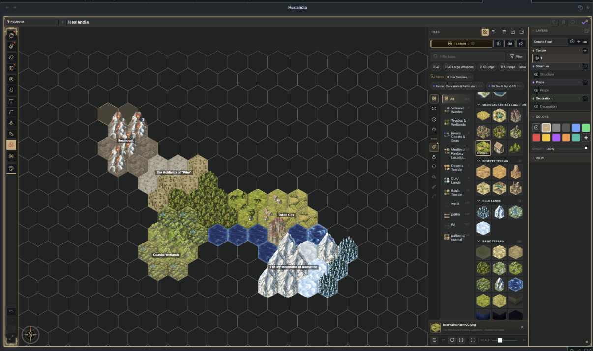

Windrose supports both **grid (square) maps** — dungeons, battlemaps, building plans — and **hex maps** — world and region maps, with radial or rectangular layouts, named regions, and nested sub-maps. Touch is first class: it's designed to be fully usable on a tablet, and everything also works on desktop with keyboard and mouse conveniences layered on top.

> "Windrose" is a reference to a compass rose, a visual object I've always had a fascination with. The marketing copy would be that it speaks to the "care in design" I put into this project, but really I just liked the name. Feel free to call it just "Map Designer" — above all I want this tool to be useful.

---

## Installation

### From the Community Plugins browser

1. Open **Settings → Community plugins** and turn off Restricted mode if it is on.
2. Click **Browse**, search for **Windrose MapDesigner**, and click **Install**.
3. Click **Enable**.

### From BRAT (beta releases)

[BRAT](https://github.com/TfTHacker/obsidian42-brat) (the Beta Reviewers Auto-update Tool) installs and updates pre-release builds ahead of the stable listing.

1. Install **BRAT** from the Community Plugins browser and enable it.
2. Open the command palette and run **BRAT: Add a beta plugin for testing**.
3. Enter the repository: `alas-poor-ophelia/windrose-md`
4. BRAT downloads the latest release and installs Windrose. Enable it under **Settings → Community plugins**.

### Manual

Download `main.js`, `styles.css`, and `manifest.json` from the [latest release](https://github.com/alas-poor-ophelia/windrose-md/releases) and copy them into `<your-vault>/.obsidian/plugins/windrose-md/`. Reload Obsidian and enable the plugin.

### Migrating from the Datacore version

If you used the original Datacore-based Windrose: your maps migrate automatically. On first load, the plugin imports your settings and locates your data files from the previous installation — no manual steps. You can safely disable the old version afterward.

---

## Quick start

1. Enable Windrose. The first time, a short survey asks what kind of maps you make — it tailors which tools are visible so the interface starts at your speed. (Everything can be toggled later in settings; nothing is ever locked away.)
2. In any note, run **Windrose MapDesigner: Insert map** from the command palette, pick grid or hex, and name it. A map appears right in the note.
3. Pick the paint tool and start filling in cells — click or drag, like graph paper. Grab objects from the sidebar to drop in doors, stairs, and monsters.
4. Prefer a whole-tab canvas? Click the **compass ribbon icon** or run **Open map in full pane** to work on any map in a full workspace tab.
5. In a hurry? Run **Generate random dungeon** and let the generator do the drawing.

Maps live in your notes as a small `windrose-map` code block; the drawing data is stored in a JSON file in your vault (see [Data and sync](#data-and-sync)). They render in Reading mode, Live Preview, and even inside callouts.

---

> [!alert] FOR A FULLER FEATURE LIST....
> Check the more exhaustive [Feature List](docs/FEATURES.md) for a bit more detail on what features Windrose has and how they all work.

## Features

### Drawing

Painting is the core loop — think filling in squares on graph paper, but it can get a bit more advanced:

- **Paint** cells with customizable colors and opacity, one at a time or by dragging.
- **Rectangle and circle fills** with live previews; **diagonal fill** smooths staircase edges in one click.
- **Segment painting** (grid) subdivides a cell into eight triangles — half-cells, quarter-cells, true diagonals.
- **Edge painting** (grid) colors the grid lines themselves, cell-by-cell or in point-to-point lines — borders, walls, subdivisions.
- **Freehand drawing** creates organic, non-grid-locked shapes. Close the loop and the shape fills in and behaves like painted cells — erasable cell-by-cell, interior grid lines and all.
- **Outline tool** (hex) draws polygon shapes point-to-point.
- **Eraser** and **clear area** tools, for when your artistic vision is scuffed or a cat walks on your keyboard.
- **50-level undo/redo**, for when the cat walks on your keyboard a lot.

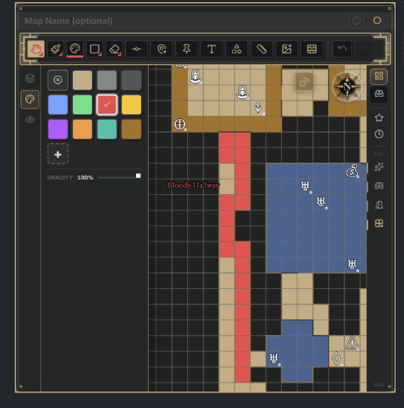

### Image tiles

New in 2.0, and the biggest thing Windrose has grown: paint your maps with **image tiles** instead of (or alongside) flat color, on both grid and hex maps.

- **The tile drawer** — a browsable, searchable library of your tiles, organized by category and tag, with grid and list views, starred favorites, and recents.
- **Six placement tools**, chosen from a ribbon in the drawer: **Paint** (per-cell), **Stamp** (single freeform placement), **Scatter** (freeform with jitter — forests in seconds), **Fill** (flood-fill an area), **Brush** (a soft, world-space terrain brush that blends seamless textures), and **Draw** (walls and paths — see below).
- **Walls and paths** — draw wall segments and winding paths that follow your cursor, with curves (drag to bow a segment) and vertex editing. Wall and path tiles from Dungeondraft packs are detected and handled automatically.
- **Dungeondraft import** — bring in a `.dungeondraft_pack` file via the **Add tiles** wizard (Settings → Tilesets) and its assets arrive already grouped and tagged. Plain image folders from your vault import through the same wizard, with automatic detection of how each tile should render.
- **Rotation, flipping, and scaling** on placed tiles; per-tileset render settings for fine control.

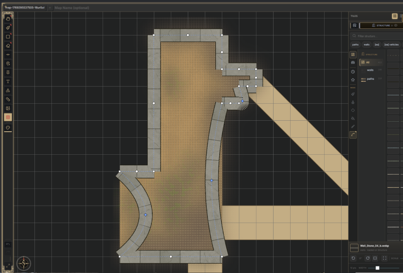

The **Add tiles** wizard walks a Dungeondraft pack (or a plain folder of images) through three steps — pick the source, confirm the guessed strata for each category, and apply tags — then extracts everything into your vault:

| 1. Source | 2. Tiers | 3. Tags | Importing |
| --- | --- | --- | --- |
| 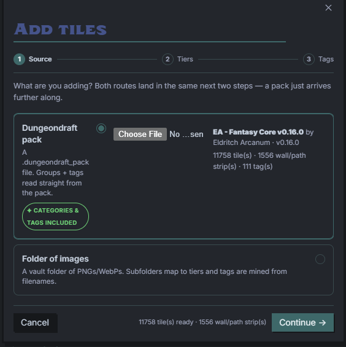 | 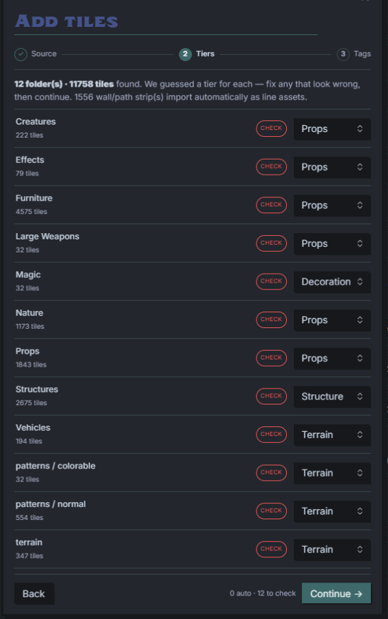 | 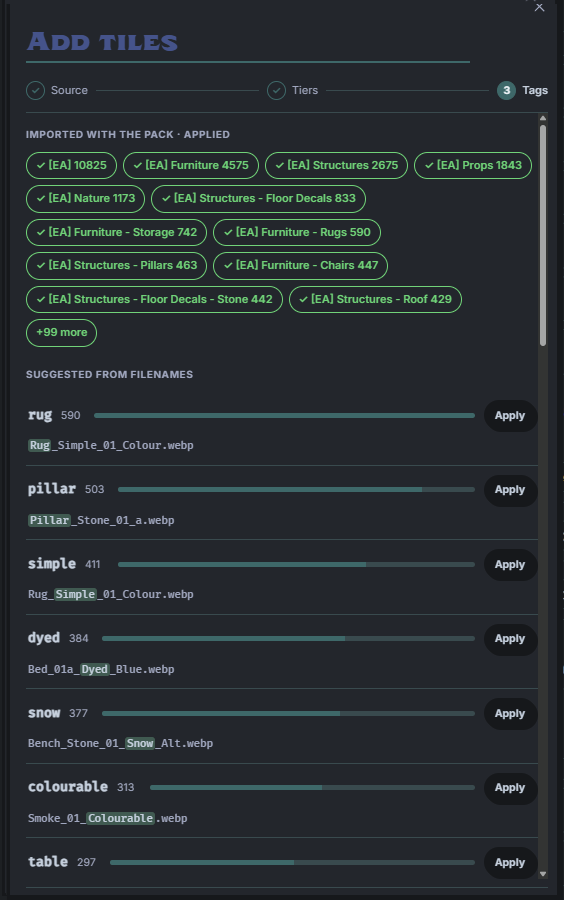 | 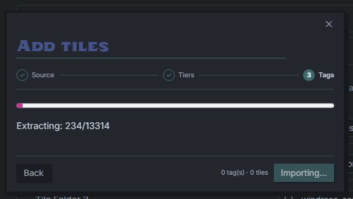 |


### Content packs

Want more variety? Browse and install **content packs** — curated object sets and fog-of-war textures — directly from the plugin (Settings → Objects → *Browse object packs*). Packs download into your vault and are ready to use immediately.

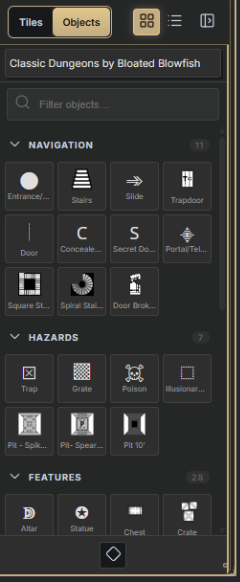

### Hex maps

- **Radial** (rings from a center) or **rectangular** (offset rows) layouts, sized per map.
- **Regions** — name and color areas of your world, painted hex-by-hex or drawn as a polygon boundary. Region names float over the map and scale with zoom; a regions sidebar jumps to or hides any of them. Regions can link to notes.
- **Sub-maps** — double-click a hex to drill into a nested map of its own: a full Windrose instance with its own layers, regions, and settings. Breadcrumbs track where you are. Think clicking a city on your world map to see its streets.
- **Coordinates**, pointy or flat-top orientation, and up to four objects per hex.
- **Background images** — lay a map image under the grid and size the hexes to it, with presets or full sub-pixel control. (Grid maps support background images too.)

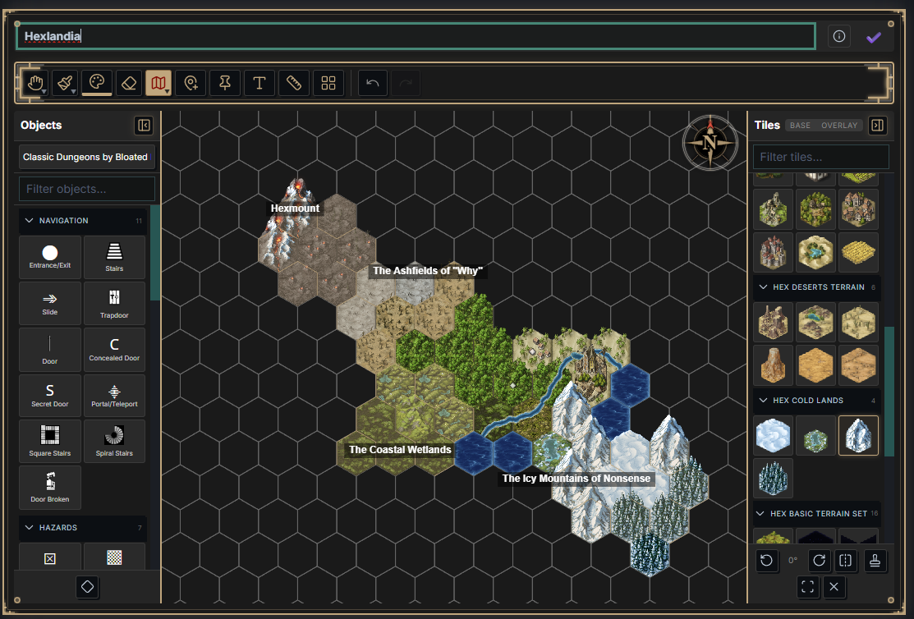

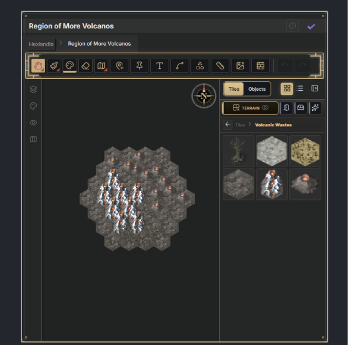

### Objects

- **~40 built-in object types** across categories — doors, stairs, portals, traps, chests, altars, monsters, NPCs, markers — and full customization: rename anything, change icons (any Unicode character, the bundled RPG Awesome set, or your own images), build custom objects and categories.
- **Object sets** — themed packs of objects you can import, export, and swap globally or per map.
- Rotate (45° steps), resize (up to 4×), recolor, duplicate, add tooltips — or forget what ♅ means and let the tooltip remind you.
- **Grid, edge, or freeform placement** — objects snap to cell centers by default; hold Alt to snap to edges, or unlock an object entirely for free world-space positioning.
- **Link any object to a note** — hover to preview, Ctrl/Cmd+click to open. Link objects *to each other* for staircases between floors or portals across maps.
- **Deep links** — copy a link to any object and paste it in another note; clicking it opens the map and zooms to that object. Hovering shows a thumbnail preview with a crosshair on the target.

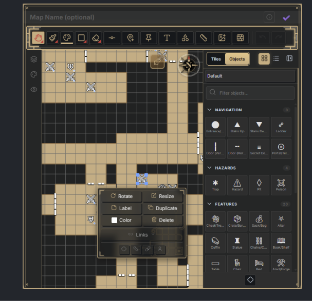

### Text labels and note pins

- **Text labels** go anywhere, free of the grid — drag, rotate, edit in place, with configurable font, size, color, and opacity, and optional note links.
- **Note pins** link a spot on the map straight to a vault note and display as a pin icon — a lighter-weight alternative to objects when the note *is* the point.

### Boards, Strata, and Layers

Windrose is like an onion. It has layers. No but really. There's 3 layers of layers.

#### Boards
Give an entire map multiple layers — floors of a dungeon, states of a battlefield, before-and-after with the **boards** feature (previously layers). Rename them, give them icons, and adjust per-layer opacity so lower floors ghost through for alignment. Objects can link between layers.

The Boards/overall layers display can be swapped between a "simple" mode that only shows a flat list of **boards** and the more complex view that shows the other layer classifications.

**_NOTE**: If you don't care about image tiles, you don't need to care about Strata or Layers. You are however, still free to use them even without image tiles._

#### Strata
When painting with images tiles, there are 4 hardcoded **Strata**. From the ground and up, starting with **Terrain**, there is:
1. Terrain - Your base ground layer
2. Structure - Walls, paths, etc
3. Props - Furniture, clutter, accoutrements
4. Decorations - Your finishing touches, items on tables, etc.

Although you can put anything on any strata, Dungeondraft packs in specific will get auto-categorized to put appropriate styles of tiles in the right strata. You can however change this either while importing, or later. 

Of course, you may want to work with multiple layers in each strata...

#### Layers
**Layers** are the sub-categorization of strata. Have a base of grass, but want to soft brush in some patches of old cobble as a separately editable composition? You can with these layers. Layers can be individually toggled for visibility.


### Fog of war

Obscure any part of a map — for hex crawls, solo dungeon delving, or theatrics:

- Fog with a solid color or a tileable image from your vault (or an installed fog texture pack).
- Add or clear fog cell-by-cell, in rectangles, or across the whole map at once.
- Optional edge blur for a softer, more immersive look.


### Random dungeon generation

Generate a full dungeon layout from the command palette — pure old-fashioned math and graphs, no AI involved; the generation animation you watch is an approximation of the actual algorithm at work. Not that you cared.

- **Four styles** — Classic, Cavern, Fortress, Crypt — in three sizes, with advanced sliders for room shapes, corridor styles, door and secret-door frequency, water features, and more, with a live preview that updates as you tweak.
- **Dungeon stocking** optionally populates rooms with monsters, traps, treasure, and themed furniture.
- **Solo play**: auto-fog the generated dungeon and explore it room by room.

| The generator | The result |
| --- | --- |
| 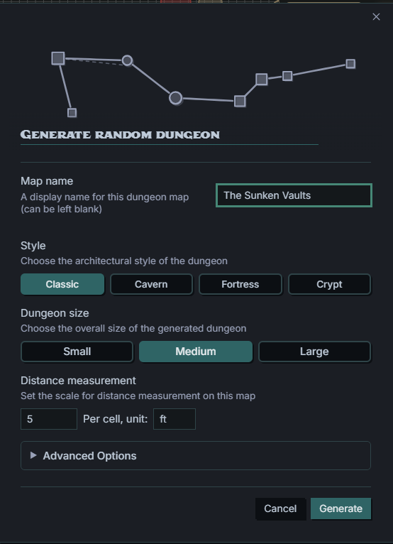 | 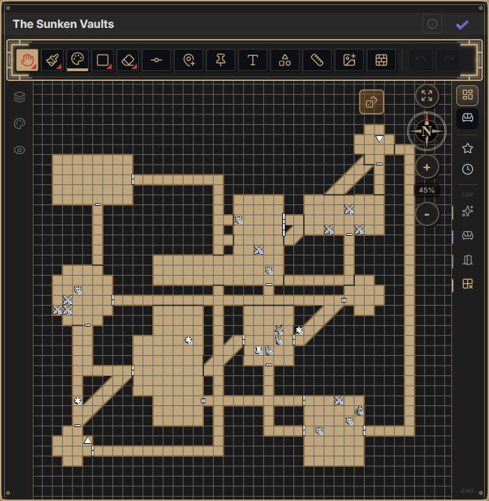 |

#### Solo-play
Windrose has a small set of solo play features that are more by emergence than purposeful design, but worth calling out.

**Player tokens**: An object can be designated as a "player". This unlocks the ability to measure/show movement across the grid, as well as a toggleable **lighty radius** that will auto clear **fog of war** if dropped onto it.

### Full-pane view

Maps don't have to live inline. Open any map in a **full workspace tab** — from the compass ribbon icon, the command palette, or a picker that lists every map in your vault. Panels like the tile drawer can **pop out into floating, dockable windows**, Photoshop-style, when you want the canvas to yourself.


### An interface that scales with you

Windrose has grown a lot of tools, and not everyone wants all of them on day one. A **first-run survey** (four quick questions) sets up the interface for how you map — dungeon-crawler, worldbuilder, GM, or all three. Behind it are simple feature toggles in settings: hex maps, regions, sub-maps, fog of war, tiles, walls, the dungeon generator, and more can each be switched on or off at any time. Off means *hidden*, never *gone* — flip a toggle and the tool is back.

### Navigation

- **Pan**: drag with the select tool, hold Space and drag with any tool, hold the scroll wheel, or two-finger drag on touch.
- **Zoom**: scroll wheel, pinch, or the zoom controls (10%–200%).
- **Rotate** the whole map via the Windrose compass in the corner (grid maps rotate for real; on hex it's aesthetic — and it looks great).
- **Measure** point-to-point distances in units you configure globally or per map.

---

## Configuration

- **Global settings** (Settings → Windrose MapDesigner): defaults for colors and palettes, hex orientation, fog of war, object sets and custom objects, tileset folders and tile packs, feature toggles, keyboard shortcuts, and more.
- **Per-map settings** (from the map controls): override any global default for one map — grid colors, fog style, object set, background image, hex layout and size, canvas height, measurement units — plus **PNG export** of the current layer, background and all.

## Data and sync

A map in a note is just a small code block:

````
```windrose-map
id: your-map-id
name: My Map
type: grid
```
````

This works the same as any other codeblock in Obsidian. For instance, put it in a callout like this:
````
> [!INFO]
> ```windrose-map
> id: your-map-id
> name: My Map
> type: grid
```
````

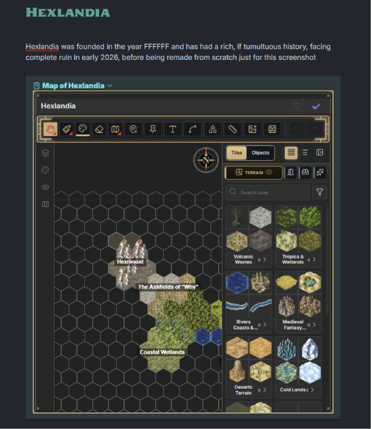

The drawing data lives in `windrose-map-data.json` in your vault, keyed by `id` — plain JSON that travels with your vault and works with Obsidian Sync and friends. Delete the code block and your data is still there; paste the block somewhere else and the map comes with it.

---

## Thanks to

Many members of the Obsidian TTRPG discord, including:
- BloatedBlowfish
- Coehoorn
- 36457453746
- LastElf
- And many others, especially those who goaded me into and taught me about hex mapping.

My DM, who got me excited about both TTRPGs, and about having fun with software dev again.

And Blacksmithgu for creating [Datacore](https://github.com/blacksmithgu/datacore) — Windrose started life as a Datacore compiled script, and that framework is what made it possible to trick myself into thinking that learning React was a good idea. v2.0 is a standalone plugin, but we wouldn't be here without that foundation.

## License

[MIT](LICENSE)
